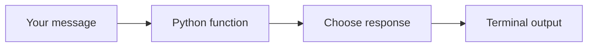

# Week 1, Day 1 — Python Foundations

## Today's finish line

Build a small command-line assistant that:

- Accepts messages.
- Recognizes a few commands.
- Generates responses.
- Keeps running until you type `exit`.
- Passes four automated tests.

This first version does not use an LLM or persistent memory. It gives us the basic message loop that later lessons will improve.

**Video:** Coming soon

## How it works



## What you will learn

| Python concept | Purpose in our assistant |
| --- | --- |
| Variable | Holds a message |
| Function | Generates a response |
| `if` statement | Chooses what to do |
| Loop | Keeps the assistant running |
| Dictionary | Connects commands with responses |
| `if __name__ == "__main__"` | Makes `run()` the entry point when the script starts |

## Prerequisites

- Python 3.10 or newer
- A terminal
- A code editor such as Visual Studio Code

## Step 1 — Create the project

Run these commands in your terminal:

```bash
mkdir -p trexovia-assistant/tests
cd trexovia-assistant

python3 -m venv .venv
source .venv/bin/activate

touch app.py
touch tests/__init__.py
touch tests/test_app.py
touch .gitignore
```

> On Windows PowerShell, activate the environment with `.venv\Scripts\Activate.ps1`.

Confirm Python works:

```bash
python --version
```

Your project should look like this:

```text
trexovia-assistant/
├── app.py
├── tests/
│   ├── __init__.py
│   └── test_app.py
└── .gitignore
```

## Step 2 — Add `.gitignore`

Open `.gitignore` and paste:

```gitignore
.venv/
__pycache__/
*.pyc
```

## Step 3 — Build the response function

Open `app.py` and paste:

```python
RESPONSES = {
    "hello": "Hello, Obinna!",
    "hi": "Hi, Obinna!",
    "help": "I understand hello, hi, help, and exit.",
}


def generate_reply(message: str) -> str:
    cleaned_message = message.strip()
    normalized_message = cleaned_message.lower()

    if not cleaned_message:
        return "Please enter a message."

    if normalized_message in RESPONSES:
        return RESPONSES[normalized_message]

    return f"You said: {cleaned_message}"
```

The function removes unnecessary spaces, ignores capitalization when matching commands, returns a known response when possible, and otherwise repeats the message as a fallback.

Try it:

```bash
python
```

```python
from app import generate_reply

generate_reply("hello")
generate_reply("Teach me Python")
```

Expected responses:

```text
'Hello, Obinna!'
'You said: Teach me Python'
```

Exit the Python console with `exit()`.

## Step 4 — Build the conversation loop

Add this underneath `generate_reply()` in `app.py`:

```python
def run() -> None:
    print("Trexovia Assistant")
    print("Type 'help' for instructions or 'exit' to stop.\n")

    while True:
        user_message = input("You: ").strip()

        if user_message.lower() == "exit":
            print("Assistant: Goodbye!")
            break

        reply = generate_reply(user_message)
        print(f"Assistant: {reply}")


if __name__ == "__main__":
    run()
```

Run the assistant:

```bash
python app.py
```

Try this conversation:

```text
Trexovia Assistant
Type 'help' for instructions or 'exit' to stop.

You: hello
Assistant: Hello, Obinna!

You: What can you do?
Assistant: You said: What can you do?

You: exit
Assistant: Goodbye!
```

## Step 5 — Add automated tests

Open `tests/test_app.py` and paste:

```python
import unittest

from app import generate_reply


class GenerateReplyTests(unittest.TestCase):
    def test_returns_known_response(self) -> None:
        result = generate_reply("hello")

        self.assertEqual(result, "Hello, Obinna!")

    def test_ignores_capitalization_and_spaces(self) -> None:
        result = generate_reply("  HELP  ")

        self.assertEqual(
            result,
            "I understand hello, hi, help, and exit.",
        )

    def test_returns_fallback_response(self) -> None:
        result = generate_reply("Teach me Python")

        self.assertEqual(result, "You said: Teach me Python")

    def test_rejects_empty_message(self) -> None:
        result = generate_reply("   ")

        self.assertEqual(result, "Please enter a message.")


if __name__ == "__main__":
    unittest.main()
```

The `tests/__init__.py` file stays empty.

Run the tests:

```bash
python -m unittest discover -s tests -v
```

Expected result:

```text
Ran 4 tests

OK
```

## Completed project

The exact working files are in [`completed-project/trexovia-assistant`](completed-project/trexovia-assistant). You can copy that folder or compare it with your own project.

## Common mistakes

### `python: command not found`

Try `python3` in place of `python`, or reinstall Python and ensure it is available in your terminal.

### `ModuleNotFoundError: No module named 'app'`

Run the tests from the `trexovia-assistant` project directory, not from inside the `tests` folder.

### The virtual environment does not activate on Windows

Use:

```powershell
.venv\Scripts\Activate.ps1
```

### The `help` test fails

Check that the `help` value in `RESPONSES` is exactly:

```text
I understand hello, hi, help, and exit.
```

The implementation and test must contain the same sentence.

## Completion checklist

- [ ] Virtual environment created
- [ ] `python app.py` starts the assistant
- [ ] `hello`, `help`, and unknown messages work
- [ ] Typing `exit` stops the program
- [ ] All four automated tests pass
- [ ] You understand the purpose of the function, dictionary, condition, loop, and script entry point

## What comes next

Day 2 adds conversation history so the assistant can remember earlier messages during a session.
