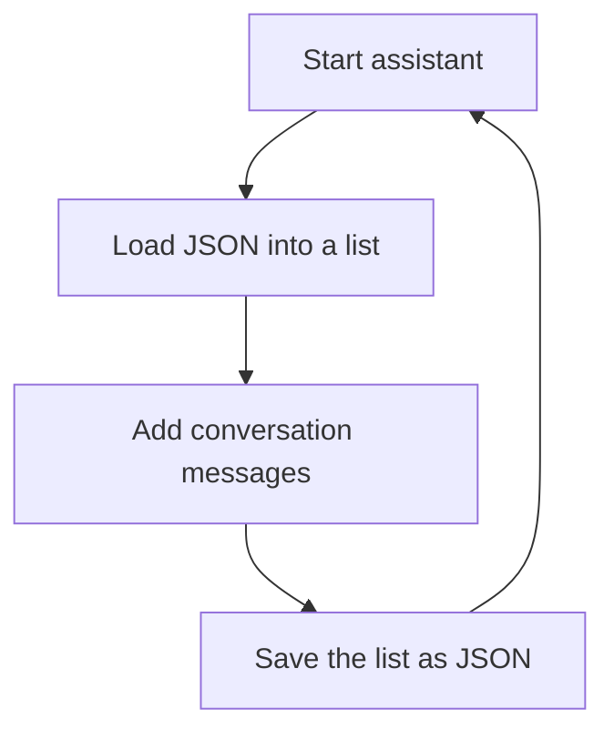

# Week 1, Day 2 — Persistent Conversation Memory

## Today’s finish line

Upgrade the command-line assistant so a conversation survives after the program closes. By the end, the assistant will save messages in JSON, reload them on startup, answer the `history` command, and pass seven tests.

**Video:** Coming soon

## How memory works

Think of a Python list as a whiteboard: it disappears when the process stops. A JSON file is a notebook: Python can close, reopen the notebook, and recover what was written.



## What you will learn

| Concept | Job in the assistant |
| --- | --- |
| List | Holds the conversation in memory while Python runs |
| Dictionary | Represents one message with a role and content |
| JSON | Stores the list on disk between runs |
| `Path` | Describes where the JSON file lives |
| Module | Keeps memory code separate from conversation code |
| Dependency injection | Lets a function receive test data instead of reading real data |

## Prerequisites

- The completed Day 1 project
- Python 3.9 or newer
- A terminal and code editor

## Step 1 — Prepare the memory layer

Before the assistant can remember anything, give the storage logic its own module. This prevents `app.py` from becoming responsible for input, responses, and file storage at the same time.

From the `trexovia-assistant` directory, run:

```bash
source .venv/bin/activate
touch memory.py tests/test_memory.py
mkdir -p data
```

> On Windows PowerShell, activate with `.venv\Scripts\Activate.ps1`.

Open `.gitignore` and add this line at the bottom:

```gitignore
data/history.json
```

The conversation file is personal runtime data, so Git should not publish it.

**Check your work:** Run `git status --short`. The new Python files should appear, but `data/history.json` should remain ignored once it exists.

## Step 2 — Describe one message

Before writing files, decide on the shape of the data. Each message needs to record who spoke and what they said.

Try this in the Python console:

```python
message = {
    "role": "user",       # 1
    "content": "Hello",   # 2
}
```

1. `role` distinguishes user messages from assistant messages.
2. `content` stores the actual text.

A conversation is a list of these message dictionaries:

```python
history = [message]
```

**Check your work:** Enter `history[0]["content"]`. Python should display `'Hello'`.

## Step 3 — Define the memory file

The memory module needs JSON tools and a dependable path. Open `memory.py` and add:

```python
import json                    # 1
from pathlib import Path       # 2
from typing import Dict, List  # 3


History = List[Dict[str, str]]
DEFAULT_HISTORY_PATH = Path("data/history.json")
```

1. `json` converts Python lists and dictionaries to text and back again.
2. `Path` handles file paths in a way that works across operating systems.
3. `Dict` and `List` let the type alias explain the expected message structure. This syntax works on Python 3.9 and later.

`History` is a readable nickname for “a list containing dictionaries whose keys and values are strings.”

**Check your work:** Run:

```bash
python -c "from memory import DEFAULT_HISTORY_PATH; print(DEFAULT_HISTORY_PATH)"
```

Expected output: `data/history.json`.

## Step 4 — Load existing history

On the first launch, no JSON file exists yet. The loader must treat that as an empty conversation instead of an error.

Under `DEFAULT_HISTORY_PATH` in `memory.py`, add:

```python
def load_history(path: Path = DEFAULT_HISTORY_PATH) -> History:
    if not path.exists():       # 1
        return []

    with path.open("r", encoding="utf-8") as file:  # 2
        history = json.load(file)

    if not isinstance(history, list):  # 3
        raise ValueError("Conversation history must be a list.")

    return history
```

1. A missing file means there are no previous messages.
2. The `with` block opens the file for reading and closes it automatically. UTF-8 safely supports names and messages from many languages.
3. The validation stops malformed top-level data from silently becoming conversation history.

The optional `path` parameter is important for tests: tests can use temporary files without touching your real conversation.

**Check your work:** Run:

```bash
python -c "from memory import load_history; print(load_history())"
```

Expected output: `[]`.

## Step 5 — Add a message

Loading is only half of memory. Create a small function that adds one consistently shaped message to the history list.

Under `load_history()` in `memory.py`, add:

```python
def add_message(
    history: History,
    role: str,
    content: str,
) -> None:
    history.append({             # 1
        "role": role,
        "content": content,
    })
```

1. `append()` changes the existing list. The function returns `None` because its job is the change itself.

**Check your work:** Run:

```bash
python -c "from memory import add_message; h=[]; add_message(h, 'user', 'Hello'); print(h)"
```

You should see one user message inside the list.

## Step 6 — Save history

The in-memory list still disappears when Python exits. Write it to JSON after every successful conversation turn.

Under `add_message()` in `memory.py`, add:

```python
def save_history(
    history: History,
    path: Path = DEFAULT_HISTORY_PATH,
) -> None:
    path.parent.mkdir(parents=True, exist_ok=True)  # 1

    with path.open("w", encoding="utf-8") as file:  # 2
        json.dump(history, file, indent=2)             # 3
```

1. Creates `data/` when it is missing; `exist_ok=True` makes repeated saves safe.
2. Opens the file in write mode, replacing the previous snapshot.
3. Converts the Python list into JSON. `indent=2` keeps the file readable.

**Check your work:** Run:

```bash
python -c "from memory import add_message, save_history; h=[]; add_message(h, 'user', 'Hello'); save_history(h)"
python -m json.tool data/history.json
```

You should see valid, formatted JSON.

## Step 7 — Give the assistant a `history` command

The app needs a way to search backward for the most recent user message. Open `app.py` and add these imports at the top, replacing no existing code:

```python
from typing import Dict, List, Optional

from memory import add_message, load_history, save_history


History = List[Dict[str, str]]
```

Now update the `help` value inside `RESPONSES` so the app and test share the exact same sentence:

```python
"help": "I understand hello, hi, help, history, and exit.",
```

> This exact wording fixes the Day 2 mismatch that caused `test_ignores_capitalization_and_spaces` to fail.

Below `RESPONSES`, add the accepted phrases:

```python
HISTORY_COMMANDS = {
    "history",
    "what did i say",
    "what did i say?",
}
```

Then add this function above `generate_reply()`:

```python
def find_last_user_message(history: History) -> Optional[str]:
    for message in reversed(history):  # 1
        if message["role"] == "user":  # 2
            return message["content"]

    return None                         # 3
```

1. Searches newest-to-oldest so the first match is the latest message.
2. Skips assistant replies.
3. Returns `None` when no user message exists.

**Check your work:** Run:

```bash
python -c "from app import find_last_user_message; print(find_last_user_message([{'role':'user','content':'Hello'}]))"
```

Expected output: `Hello`.

## Step 8 — Pass history into `generate_reply()`

The response function must receive history before it can answer a history question. Change the function header and add the default handling at the top of the function:

```python
def generate_reply(
    message: str,
    history: Optional[History] = None,  # 1
) -> str:
    if history is None:                 # 2
        history = []
```

1. Existing Day 1 calls such as `generate_reply("hello")` still work.
2. Creates a new empty list for that call. Avoid using `history=[]` as a default because Python would reuse the same mutable list between calls.

Inside `generate_reply()`, place this block after the known-response check and before the fallback response:

```python
if normalized_message in HISTORY_COMMANDS:
    last_message = find_last_user_message(history)  # 1

    if last_message:
        return f'Your last message was: "{last_message}"'

    return "You have not sent any previous messages."  # 2
```

1. Reuses the search function instead of duplicating its loop.
2. Gives a useful answer when the list is empty.

**Check your work:** Run:

```bash
python -c "from app import generate_reply; h=[{'role':'user','content':'Learning Python'}]; print(generate_reply('history', h))"
```

Expected output: `Your last message was: "Learning Python"`.

## Step 9 — Connect load, reply, and save

The conversation loop now needs to load once at startup and save after each successful reply. In `run()`, add this as its first line:

```python
history = load_history()  # 1
```

1. Restores the JSON snapshot before asking for new input.

Find the existing call to `generate_reply()` and pass the list:

```python
reply = generate_reply(user_message, history)
```

Finally, directly after printing the reply, add:

```python
add_message(history, "user", user_message)  # 1
add_message(history, "assistant", reply)    # 2
save_history(history)                       # 3
```

1. Stores what the user said.
2. Stores the matching assistant response.
3. Persists both messages as one updated snapshot.

**Check your work:** Run `python app.py`, send `I am building an assistant`, then type `exit`. Start it again and enter `history`. The assistant should recover the earlier message.

## Step 10 — Add automated tests

Tests should prove both branches of loading: a missing file and a successful round trip. Open `tests/test_memory.py` and first add the imports and test class:

```python
import unittest
from pathlib import Path
from tempfile import TemporaryDirectory

from memory import add_message, load_history, save_history


class MemoryTests(unittest.TestCase):
    pass
```

Replace `pass` with the missing-file test:

```python
def test_missing_file_returns_empty_history(self) -> None:
    with TemporaryDirectory() as directory:  # 1
        path = Path(directory) / "missing.json"
        self.assertEqual(load_history(path), [])
```

1. The temporary directory is automatically deleted, so the test cannot pollute your project.

Add the round-trip test underneath it:

```python
def test_saves_and_loads_messages(self) -> None:
    with TemporaryDirectory() as directory:
        path = Path(directory) / "history.json"
        history = []

        add_message(history, "user", "Hello")  # 1
        add_message(history, "assistant", "Hi!")
        save_history(history, path)             # 2

        self.assertEqual(load_history(path), history)  # 3
```

1. Builds the same data shape used by the app.
2. Writes only to a temporary file.
3. Proves that save followed by load reproduces the original list.

In `tests/test_app.py`, update the expected `help` response to include `history`, then add `test_returns_last_user_message()` from the completed project.

**Check your work:** Run the compile check before the tests:

```bash
python -m compileall -q app.py memory.py tests
python -m unittest discover -s tests -v
```

Expected result:

```text
Ran 7 tests

OK
```

## Completed project

The exact, verified files are in [`completed-project/trexovia-assistant`](completed-project/trexovia-assistant). Use them to compare your work after completing the steps, not as a replacement for building each step.

## Common mistakes

### The `help` test fails

The implementation and test must both use:

```text
I understand hello, hi, help, history, and exit.
```

### `JSONDecodeError` appears

`data/history.json` is not valid JSON. During development, delete only that file and restart the app to create a clean history.

### History always comes back empty

Run `python app.py` from the project directory. The relative path `data/history.json` starts from the directory in which the command runs.

## Completion checklist

- [ ] `memory.py` loads a missing file as an empty list
- [ ] Each conversation turn is saved to `data/history.json`
- [ ] History reloads after restarting the program
- [ ] The `history` command returns the latest user message
- [ ] The implementation and test use identical `help` text
- [ ] Python compilation succeeds
- [ ] All seven tests pass

## What comes next

Day 3 replaces the rule-based fallback with a real LLM while preserving local commands and JSON memory.
