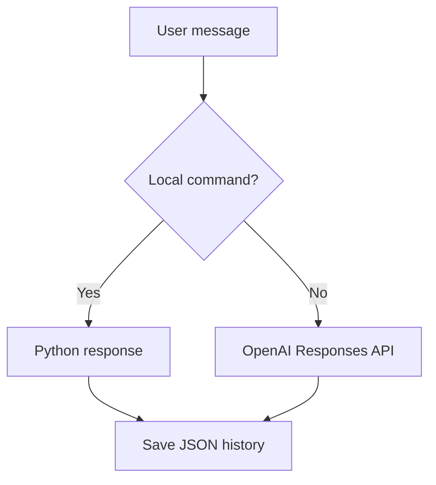

# Week 1, Day 3 — Connect a Real LLM

## Today’s finish line

Replace the rule-based fallback with a live OpenAI model while preserving deterministic local commands, JSON memory, and offline automated tests. You will also add a `clear history` command.

**Video:** Coming soon

## How an LLM changes the assistant

Day 2 could only recognize phrases we wrote in advance. Day 3 keeps those dependable local commands but sends every other meaningful message to a model.



## What you will learn

| Concept | Job in the assistant |
| --- | --- |
| LLM | Generates a response for messages not covered by local commands |
| API client | Sends a request to the model service |
| Environment variable | Keeps secrets and configuration outside source code |
| `python-dotenv` | Loads local `.env` values during development |
| Dependency injection | Replaces the live API with a fake client in tests |
| Context window | Limits how much recent history is sent in one request |

This lesson follows the [official OpenAI quickstart](https://developers.openai.com/api/docs/quickstart) and the [OpenAI text-generation guide](https://developers.openai.com/api/docs/guides/text). The current guidance recommends the Responses API for text-generation apps and exposes generated text through `response.output_text`.

## Prerequisites

- The completed Day 2 project
- Python 3.9 or newer
- An OpenAI API key
- A model enabled for your OpenAI project

> Never paste a real API key into Python code, Git, screenshots, or chat. Revoke and replace any exposed key.

## Step 1 — Confirm the active Python runtime

Compiled code can still fail at runtime when `python` and `pip` belong to different installations. Verify the interpreter before installing anything.

From `trexovia-assistant`, run:

```bash
source .venv/bin/activate
python --version
python -c "import sys; print(sys.executable)"
python -m pip --version
```

All three commands should point to `.venv`. This lesson uses `typing.List`, `typing.Dict`, and `typing.Optional` so its annotations work consistently on Python 3.9 through 3.13.

**Check your work:** If either executable path does not contain `.venv`, deactivate the shell and activate the project environment again before continuing.

## Step 2 — Install the dependencies

The OpenAI SDK sends API requests. `python-dotenv` reads local development settings from `.env`, avoiding a manual `source .env` every time you open a terminal.

Create `requirements.txt` with:

```text
openai>=2.0.0,<3.0.0
python-dotenv>=1.0.0,<2.0.0
```

Install through the active interpreter:

```bash
python -m pip install -r requirements.txt
```

**Check your work:** Run:

```bash
python -c "import openai, dotenv; print('Dependencies imported successfully')"
```

Expected output: `Dependencies imported successfully`.

## Step 3 — Configure secrets safely

The app needs an API key and model ID, but neither belongs inside `app.py`. A local `.env` file provides them to the process, while `.gitignore` prevents accidental commits.

Create `.env.example` with safe placeholders:

```dotenv
OPENAI_API_KEY=replace-with-your-api-key
OPENAI_MODEL=replace-with-a-model-enabled-for-your-project
```

Copy it to a private local file:

```bash
cp .env.example .env
```

Open `.env`, replace both placeholders, and add these lines to `.gitignore`:

```gitignore
.env
data/history.json
```

`OPENAI_MODEL` deliberately has no hard-coded course default because model access can differ between projects. Use a model ID shown as available in your OpenAI project.

**Check your work:** Confirm configuration without displaying the secret:

```bash
python -c "from dotenv import load_dotenv; load_dotenv(); import os; print('Key:', bool(os.getenv('OPENAI_API_KEY'))); print('Model:', bool(os.getenv('OPENAI_MODEL')))"
```

Both values should be `True`. Also run `git status --short`; `.env` must not appear.

## Step 4 — Create the LLM module

Keep API-specific logic in `llm.py`. This gives the rest of the application one simple function to call and keeps future provider changes localized.

Create `llm.py`, then add the imports and shared types:

```python
import os
from typing import Any, Dict, List, Optional  # 1


History = List[Dict[str, str]]               # 2
```

1. `Any` represents a real or fake API client; `Optional` represents a value that may initially be absent.
2. Reuses the same conversation shape as Day 2 without requiring Python 3.10 union syntax.

**Check your work:** Run `python -m py_compile llm.py`. No output means compilation succeeded.

## Step 5 — Load `.env` deliberately

The environment loader should run only when the application starts. Keeping the import inside the function lets pure offline tests import `llm.py` even before third-party packages are installed.

Below the type alias in `llm.py`, add:

```python
def load_environment() -> None:
    try:
        from dotenv import load_dotenv       # 1
    except ImportError as error:
        raise RuntimeError(
            "python-dotenv is not installed. "
            "Run: python -m pip install -r requirements.txt"
        ) from error                         # 2

    load_dotenv()                            # 3
```

1. Imports the optional development helper only when needed.
2. Converts a cryptic import failure into a repair command.
3. Reads `.env` and adds its values to the process environment.

**Check your work:** Run:

```bash
python -c "from llm import load_environment; load_environment(); print('Environment loaded')"
```

Expected output: `Environment loaded`.

## Step 6 — Set the assistant’s instructions and context limit

Every API request needs stable behavior rules. It also needs a boundary so the JSON history does not grow the request forever.

Above `load_environment()` in `llm.py`, add:

```python
SYSTEM_INSTRUCTIONS = (
    "You are Trevoxia Assistant, a friendly and concise AI assistant. "
    "Use the conversation history when it is relevant."
)

MAX_CONTEXT_MESSAGES = 10
```

`SYSTEM_INSTRUCTIONS` describes how the assistant should behave. `MAX_CONTEXT_MESSAGES` limits the API input to five user/assistant turns when messages occur in pairs.

**Check your work:** Run:

```bash
python -c "from llm import MAX_CONTEXT_MESSAGES; print(MAX_CONTEXT_MESSAGES)"
```

Expected output: `10`.

## Step 7 — Build the model input

The model needs recent history followed by the current question. Add this function below `load_environment()`:

```python
def build_input(message: str, history: History) -> History:
    recent_history = history[-MAX_CONTEXT_MESSAGES:]  # 1

    return [
        *recent_history,                              # 2
        {
            "role": "user",
            "content": message,
        },                                           # 3
    ]
```

1. A negative slice keeps only the newest messages and safely handles shorter lists.
2. `*` expands those dictionaries into a new list instead of changing the original history.
3. Places the current question last, which matches the order in which the conversation occurred.

**Check your work:** Run:

```bash
python -c "from llm import build_input; print(build_input('Current question', []))"
```

You should see one user message containing `Current question`.

## Step 8 — Call the Responses API

Now create the boundary that turns a message and its history into generated text. The optional `client` and `model` parameters let tests supply harmless substitutes.

Below `build_input()` in `llm.py`, start the function with configuration validation:

```python
def generate_ai_reply(
    message: str,
    history: History,
    client: Optional[Any] = None,
    model: Optional[str] = None,
) -> str:
    model_name = model or os.getenv("OPENAI_MODEL")  # 1

    if not model_name:
        raise RuntimeError("OPENAI_MODEL is not configured.")  # 2
```

1. A test can provide a model directly; otherwise the live app reads `.env`.
2. Fails early with a useful message instead of sending an invalid request.

Continue inside the same function with the client setup:

```python
if client is None:
    try:
        from openai import OpenAI              # 1
    except ImportError as error:
        raise RuntimeError(
            "openai is not installed. "
            "Run: python -m pip install -r requirements.txt"
        ) from error

    client = OpenAI()                          # 2
```

1. Imports the SDK only for a real call. Tests pass a fake client and never reach this line.
2. The SDK automatically reads `OPENAI_API_KEY` from the environment, as described in the official quickstart.

Finish the function with the request and response validation:

```python
response = client.responses.create(
    model=model_name,                          # 1
    instructions=SYSTEM_INSTRUCTIONS,          # 2
    input=build_input(message, history),       # 3
    store=False,                               # 4
)

reply = response.output_text.strip()           # 5

if not reply:
    raise RuntimeError("The AI service returned an empty response.")

return reply
```

1. Selects the model configured for this project.
2. Sends the assistant’s high-level behavior rules.
3. Sends recent context plus the new user message.
4. Avoids separate response storage because this lesson manages memory in local JSON.
5. Uses the SDK’s combined text helper and removes accidental surrounding whitespace.

**Check your work:** Run `python -m py_compile llm.py` again. Do not make a paid API call yet.

## Step 9 — Route unknown messages to the LLM

Local commands should stay fast and predictable. Only the old fallback branch should change.

At the top of `app.py`, add `Callable` to the typing imports and import the LLM functions:

```python
from typing import Callable, Dict, List, Optional

from llm import generate_ai_reply, load_environment
```

Under the `History` alias, add a type for any compatible model function:

```python
LLMFunction = Callable[[str, History], str]
```

Change the `generate_reply()` header to accept that function:

```python
def generate_reply(
    message: str,
    history: Optional[History] = None,
    llm_function: Optional[LLMFunction] = None,  # 1
) -> str:
```

1. Tests can inject a small fake function; production leaves this as `None`.

Find the final `return f"You said: ..."` fallback and replace only that line with:

```python
if llm_function is None:               # 1
    llm_function = generate_ai_reply

return llm_function(cleaned_message, history)  # 2
```

1. Chooses the live OpenAI function only when the caller did not supply a substitute.
2. Passes both the clean current message and conversation context.

At the beginning of `run()`, before loading history, add:

```python
load_environment()
```

**Check your work:** Do not call an unknown message yet. Run `python -c "from app import generate_reply; print(generate_reply('hello'))"`. The local `hello` command should work without an API request.

## Step 10 — Handle API failures

A network or authentication error should not crash the conversation loop or save a reply that never arrived. Find the `reply = generate_reply(...)` line in `run()` and wrap it:

```python
try:
    reply = generate_reply(user_message, history)  # 1
except Exception as error:
    print("Assistant: I could not reach the AI service.")
    print(f"Details: {error}")                     # 2
    continue                                       # 3
```

1. Attempts the live response.
2. Shows the actual diagnostic without pretending the request succeeded.
3. Starts the next loop iteration before messages are added or saved.

**Check your work:** Temporarily set `OPENAI_MODEL` to an invalid value, run `python app.py`, and send an unknown message. You should see a readable error and remain inside the app. Restore the valid model afterward.

## Step 11 — Add `clear history`

A user should be able to remove local memory without manually opening JSON. Add the accepted phrases below `HISTORY_COMMANDS` in `app.py`:

```python
CLEAR_HISTORY_COMMANDS = {
    "clear history",
    "clear memory",
}
```

Above `generate_reply()`, add a small command handler:

```python
def clear_history_if_requested(message: str, history: History) -> bool:
    if message.strip().lower() not in CLEAR_HISTORY_COMMANDS:  # 1
        return False

    history.clear()                                           # 2
    return True                                                # 3
```

1. Returns immediately when this is an ordinary message.
2. Empties the existing list used by the conversation loop.
3. Tells the caller that it handled the command.

Inside `run()`, place this block after the `exit` check and before the LLM `try` block:

```python
if clear_history_if_requested(user_message, history):
    save_history(history)                              # 1
    print("Assistant: Conversation history cleared.")
    continue                                           # 2
```

1. Persists the empty list, so the deletion survives a restart.
2. Prevents the clear command itself from being added back into history.

Update the `help` response to exactly:

```text
I understand hello, hi, help, history, clear history, and exit.
```

**Check your work:** Run the app, create one conversation turn, enter `clear history`, then inspect `data/history.json`. It should contain `[]`.

## Step 12 — Test without using API credits

Automated tests should be fast, deterministic, and free. A fake client records the request and returns a known response without contacting OpenAI.

Create `tests/test_llm.py`. After its imports, add the two fakes:

```python
class FakeResponses:
    def __init__(self) -> None:
        self.last_request = {}                        # 1

    def create(self, **kwargs: object) -> SimpleNamespace:
        self.last_request = kwargs                    # 2
        return SimpleNamespace(output_text="Mock AI response")


class FakeClient:
    def __init__(self) -> None:
        self.responses = FakeResponses()              # 3
```

1. Provides a place to inspect what the app tried to send.
2. Captures keyword arguments and returns an object shaped like the SDK response.
3. Recreates only the `client.responses.create(...)` surface our code uses.

Add one test for context trimming and one for the API request. See the completed project for the exact methods, then verify their intent:

- `test_build_input_keeps_recent_history` proves only ten old messages plus the current question are sent.
- `test_generate_ai_reply_uses_responses_api` proves the selected model and `store=False` reach the client.

In `tests/test_app.py`, replace the old fallback test with a fake LLM test:

```python
def test_uses_llm_for_unknown_message(self) -> None:
    def fake_llm(message: str, history: list) -> str:  # 1
        return f"AI reply to: {message}"

    result = generate_reply(
        "Teach me Python",
        llm_function=fake_llm,                        # 2
    )

    self.assertEqual(result, "AI reply to: Teach me Python")
```

1. Matches the production function’s input and output without a network call.
2. Injects the fake only for this test.

Also add `test_clear_history_command_empties_memory()` from the completed project. This raises the suite from the original nine tests to ten because the completed challenge now has its own regression test.

**Check your work:** Run:

```bash
python -m compileall -q app.py llm.py memory.py tests
python -m unittest discover -s tests -v
```

Expected result:

```text
Ran 10 tests

OK
```

## Step 13 — Make one live request

The offline suite proves your code’s decisions. One manual request proves the credentials, model access, network, and SDK work together.

Run:

```bash
python app.py
```

Try:

```text
You: Explain an API in one short sentence.
```

Then test memory:

```text
You: My favourite programming language is Python.
You: What is my favourite programming language?
```

Finally enter `clear history`, followed by `exit`.

**Check your work:** Restart the assistant and enter `history`. It should say there are no previous messages.

## Completed project

The exact, verified files are in [`completed-project/trexovia-assistant`](completed-project/trexovia-assistant). Build the lesson incrementally first, then compare your result with this reference.

## Common mistakes

### Code compiles but fails when run

Confirm the runtime and installer point to the same virtual environment:

```bash
python -c "import sys; print(sys.version); print(sys.executable)"
python -m pip --version
python -m pip install -r requirements.txt
```

### `No module named openai` or `No module named dotenv`

Install requirements with `python -m pip`, not a possibly unrelated `pip` executable.

### `OPENAI_MODEL is not configured`

Ensure `.env` exists beside `app.py`, contains `OPENAI_MODEL=...`, and has no placeholder value.

### Authentication error

Create a valid API key, place it only in `.env`, and revoke any key that was exposed.

### `model_not_found`

Use a model ID enabled for your OpenAI project. Availability can vary by account and project.

### The `help` test fails

The implementation and test must both mention `clear history` with identical punctuation.

## Completion checklist

- [ ] `python`, `python -m pip`, and the project use the same virtual environment
- [ ] `.env` is ignored and contains a valid key and accessible model
- [ ] `python-dotenv` loads local configuration
- [ ] Local commands do not call the API
- [ ] Unknown messages receive live model responses
- [ ] Only the ten latest stored messages are sent as context
- [ ] `clear history` empties and saves memory
- [ ] Python compilation succeeds
- [ ] All ten offline tests pass
- [ ] One live contextual conversation succeeds

## What comes next

Day 4 will move from a terminal loop toward a simple chat interface while keeping the LLM and memory layers separated and testable.
