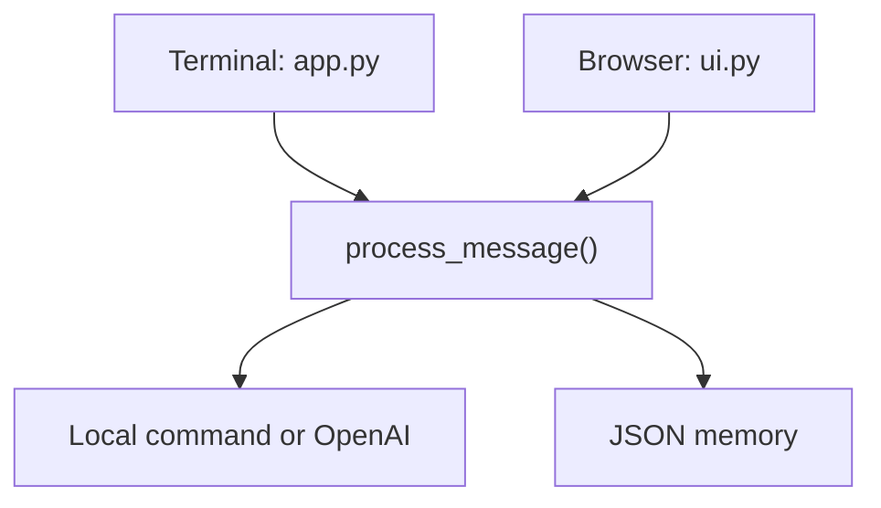

# Week 1, Day 4 — Build the Browser Chat

## Today’s finish line

Turn the terminal assistant into a simple Streamlit browser chat without duplicating conversation rules. Both interfaces will share one tested message-processing function and the same persistent JSON memory.

**Video:** Coming soon

## What changes today

Day 3 already has a real LLM, local commands, and JSON memory. Day 4 adds a browser interface while preserving the terminal interface.



The important design decision is that Streamlit does not implement its own assistant logic. It calls the same `process_message()` workflow as the terminal.

## What you will learn

| Concept | Job in the assistant |
| --- | --- |
| Streamlit | Turns Python code into a local browser interface |
| Shared workflow | Keeps terminal and browser behavior consistent |
| Dependency injection | Lets tests replace reply and save operations |
| Session state | Preserves in-memory history across Streamlit reruns |
| Chat components | Render user and assistant messages clearly |
| Regression test | Protects behavior while the interface changes |

## Prerequisites

- The completed Day 3 project
- Python 3.9.6 or newer
- An active virtual environment
- A configured `.env` file for live model requests

The verified starting point is application commit [`15e20f0`](https://github.com/brainox/trexovia-assistant/commit/15e20f04e0a6d976eff81cb2409c4ea7454d77c8). It has nine passing tests and no Streamlit interface.

## Step 1 — Verify the starting point

Start from known-good Day 3 code before changing the architecture.

```bash
cd trexovia-assistant
git pull
source .venv/bin/activate
python --version
python -m pip --version
python -m pip install -r requirements.txt
python -m compileall -q app.py llm.py memory.py tests
python -m unittest discover -s tests -v
```

The baseline should report:

```text
Ran 9 tests

OK
```

**Check your work:** Resolve any Day 3 failure before adding the browser interface.

## Step 2 — Create the new files

The browser interface and the tests for the shared chat workflow each get their own file.

```bash
touch ui.py tests/test_chat.py
```

Your project will end with this structure:

```text
trexovia-assistant/
├── app.py
├── llm.py
├── memory.py
├── ui.py
├── requirements.txt
└── tests/
    ├── __init__.py
    ├── test_app.py
    ├── test_chat.py
    ├── test_llm.py
    └── test_memory.py
```

## Step 3 — Extract the clear-history decision

The Day 3 terminal loop clears history inline. A browser cannot reuse code trapped inside `run()`, so first move that decision into a small function.

In `app.py`, update the help response and add the shared constants and types below `RESPONSES`:

```python
RESPONSES = {
    "hello": "Hello, Obinna!",
    "hi": "Hi, Obinna!",
    "help": (
        "I understand hello, hi, help, history, clear, and exit."
    ),
}

CLEAR_COMMANDS = {"clear", "clear history"}       # 1
CLEAR_CONFIRMATION = "Conversation history cleared."

History = list[dict[str, str]]                     # 2
ReplyFunction = Callable[[str, History], str]      # 3
SaveFunction = Callable[[History], None]
```

1. Gives the terminal and browser the same accepted clear commands and response.
2. Names the message-list shape used throughout the workflow.
3. Describes replaceable reply and save functions for deterministic tests.

Above `generate_reply()`, add:

```python
def clear_history_if_requested(
    message: str,
    history: History,
) -> bool:
    if message.strip().lower() not in CLEAR_COMMANDS:  # 1
        return False

    history.clear()                                    # 2
    return True                                        # 3
```

1. Normalizes capitalization and spaces before matching.
2. Empties the existing shared list.
3. Tells the caller whether the command was handled.

**Check your work:** Run `python -m py_compile app.py`.

## Step 4 — Build one reusable message workflow

A complete turn must generate a reply, append both messages, save history, and return the reply. Put that behavior in one function so every interface follows the same rules.

Below `generate_reply()`, add:

```python
def process_message(
    message: str,
    history: History,
    reply_function: ReplyFunction = generate_reply,
    save_function: SaveFunction = save_history,
) -> str:
    if clear_history_if_requested(message, history):  # 1
        save_function(history)
        return CLEAR_CONFIRMATION

    reply = reply_function(message, history)           # 2

    add_message(history, "user", message)              # 3
    add_message(history, "assistant", reply)
    save_function(history)                             # 4

    return reply
```

1. Handles and persists a clear request without saving the command as a message.
2. Generates the reply through the supplied function.
3. Records the complete user/assistant turn.
4. Saves only after the in-memory history is complete.

Inside `run()`, replace the inline clear, reply, append, and save blocks with:

```python
reply = process_message(user_message, history)
print(f"Assistant: {reply}")
```

The terminal is now a thin interface around the shared workflow.

**Check your work:** Run `python app.py`. Confirm a normal message, `history`, `clear`, and `exit` still behave correctly.

## Step 5 — Test the shared workflow

The browser will depend on `process_message()`, so test its behavior before building the UI. Open `tests/test_chat.py` and add:

```python
import unittest

from app import (
    CLEAR_CONFIRMATION,
    clear_history_if_requested,
    process_message,
)


class ChatWorkflowTests(unittest.TestCase):
    def test_clear_history_if_requested_recognizes_command(self) -> None:
        history = [{"role": "user", "content": "Remember this"}]

        handled = clear_history_if_requested(
            "  CLEAR HISTORY  ",
            history,
        )

        self.assertTrue(handled)
        self.assertEqual(history, [])

    def test_process_message_saves_complete_turn(self) -> None:
        history = []
        saved_snapshots = []

        def fake_reply(message: str, current_history: list) -> str:
            return "An API connects software systems."

        def fake_save(current_history: list) -> None:
            saved_snapshots.append(list(current_history))

        reply = process_message(
            "Teach me APIs",
            history,
            reply_function=fake_reply,
            save_function=fake_save,
        )

        self.assertEqual(reply, "An API connects software systems.")
        self.assertEqual(len(history), 2)
        self.assertEqual(saved_snapshots, [history])

    def test_process_message_clears_and_saves_history(self) -> None:
        history = [{"role": "user", "content": "Private message"}]
        saved_snapshots = []

        def fake_save(current_history: list) -> None:
            saved_snapshots.append(list(current_history))

        reply = process_message(
            "clear",
            history,
            save_function=fake_save,
        )

        self.assertEqual(reply, CLEAR_CONFIRMATION)
        self.assertEqual(history, [])
        self.assertEqual(saved_snapshots, [[]])
```

These tests never call OpenAI or write to the real history file. The injected fakes make them fast, deterministic, and free.

Update the help assertion in `tests/test_app.py` to exactly:

```text
I understand hello, hi, help, history, clear, and exit.
```

**Check your work:** Run the test suite. It should now report 12 passing tests.

## Step 6 — Install Streamlit

Streamlit supplies the browser, chat, sidebar, and session-state components. The project pins version 1.50.0 because the learning environment uses Python 3.9.6.

```bash
python -m pip install streamlit==1.50.0
```

Add the dependency to `requirements.txt`:

```text
openai==2.48.0
python-dotenv==1.1.1
streamlit==1.50.0
```

**Check your work:** Run:

```bash
python -c "import streamlit; print(streamlit.__version__)"
```

Expected output: `1.50.0`.

## Step 7 — Configure the browser page and memory

Streamlit reruns `ui.py` after every interaction. Session state keeps one in-memory history list across those reruns.

At the top of `ui.py`, add:

```python
import streamlit as st

from app import process_message
from memory import load_history


st.set_page_config(
    page_title="Trevoxia Assistant",  # 1
    page_icon="💬",
)

if "history" not in st.session_state:          # 2
    st.session_state.history = load_history()  # 3

history = st.session_state.history             # 4
```

1. Sets the browser-tab title and icon.
2. Loads disk history only for the first run in this browser session.
3. Restores messages saved by the terminal or an earlier browser session.
4. Gives the remaining UI one short reference to the shared list.

Add the page heading:

```python
st.title("Trevoxia Assistant")
st.caption("A browser chat with persistent JSON memory")
```

## Step 8 — Render saved messages

The interface should reconstruct the full conversation whenever Streamlit reruns.

```python
for message in history:                     # 1
    with st.chat_message(message["role"]):  # 2
        st.markdown(message["content"])
```

1. Walks through messages in their original order.
2. Uses each saved role to select the correct chat bubble.

**Check your work:** Run the UI now. Existing JSON history should appear in the browser.

## Step 9 — Accept a message and show the reply

The browser input calls the shared workflow, displays a thinking indicator, and presents errors without pretending the request succeeded.

```python
if user_message := st.chat_input("Message Trevoxia"):  # 1
    with st.chat_message("user"):
        st.markdown(user_message)

    try:
        with st.chat_message("assistant"):
            with st.spinner("Thinking..."):            # 2
                reply = process_message(
                    user_message,
                    history,
                )
            st.markdown(reply)                          # 3
    except Exception as error:
        st.error(f"I could not generate a response: {error}")  # 4
```

1. Waits until the user submits a non-empty message.
2. Gives immediate feedback while the model request is running.
3. Displays the reply returned by the shared workflow.
4. Keeps a configuration or network failure visible in the page.

## Step 10 — Add memory controls

The sidebar makes persistent state visible and gives the user a clear-history button.

```python
with st.sidebar:
    st.subheader("Memory")
    st.write(
        f"User messages: {len([msg for msg in history if msg['role'] == 'user'])}"
    )
    st.write(
        f"Assistant messages: {len([msg for msg in history if msg['role'] == 'assistant'])}"
    )

    if st.button("Clear history", use_container_width=True):
        process_message("clear", history)  # 1
        st.rerun()                         # 2
```

1. Uses the same tested clear workflow as the terminal.
2. Immediately redraws the browser after the shared list is emptied.

## Step 11 — Compile and run every test

Verify syntax before exercising live services.

```bash
python -m compileall -q app.py llm.py memory.py ui.py tests
python -m unittest discover -s tests -v
```

Expected result:

```text
Ran 12 tests

OK
```

## Step 12 — Run the browser assistant

Start Streamlit through the active Python interpreter:

```bash
python -m streamlit run ui.py
```

Your browser should open automatically. If it does not, open the local URL printed in the terminal.

Test this complete flow:

1. Send `hello` and confirm the local response.
2. Ask an unknown question and confirm a live AI response.
3. Ask a follow-up question that depends on the previous message.
4. Confirm the user and assistant counters increase.
5. Select **Clear history** and confirm both counters return to zero.
6. Stop Streamlit with `Control-C`, restart it, and confirm cleared history remains empty.

## Completed project

The exact verified files are in [`completed-project/trexovia-assistant`](completed-project/trexovia-assistant). The completed application corresponds to commit [`9f2c9c0`](https://github.com/brainox/trexovia-assistant/commit/9f2c9c01db69669e3ef1724f258734bba4ef1ab9), with the README corrected to describe the real project state.

## Common mistakes

### `No module named streamlit`

Confirm the virtual environment is active and install through the same interpreter:

```bash
python -m pip install -r requirements.txt
```

### The browser opens but the API request fails

Confirm `.env` exists beside `ui.py`, contains valid `OPENAI_API_KEY` and `OPENAI_MODEL` values, and was not committed.

### The terminal works but the browser behaves differently

Both interfaces must call `process_message()`. Do not duplicate reply, append, save, or clear logic inside `ui.py`.

### Messages disappear after a Streamlit rerun

Store the loaded history in `st.session_state`. A normal local variable is recreated on every rerun.

### The help test fails

The implementation and test must both use this exact response:

```text
I understand hello, hi, help, history, clear, and exit.
```

## Completion checklist

- [ ] The nine-test Day 3 baseline passes before changes
- [ ] Terminal and browser both use `process_message()`
- [ ] Normal turns append user and assistant messages before saving
- [ ] `clear` and `clear history` persist an empty history
- [ ] Streamlit restores JSON history into session state
- [ ] Saved messages render as chat bubbles
- [ ] The thinking indicator appears during model requests
- [ ] The sidebar shows separate user and assistant counts
- [ ] The clear-history button resets the browser and disk state
- [ ] Python compilation succeeds
- [ ] All 12 offline tests pass
- [ ] One live browser conversation succeeds

## What comes next

The next lesson will improve the assistant from this verified browser-chat checkpoint while keeping the shared workflow and tests intact.
